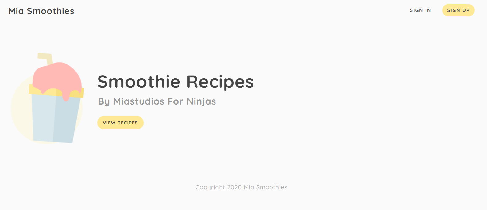
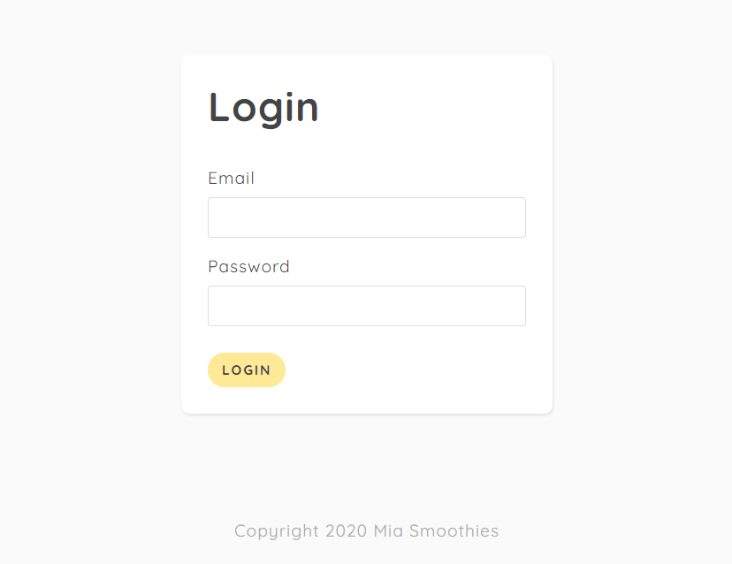
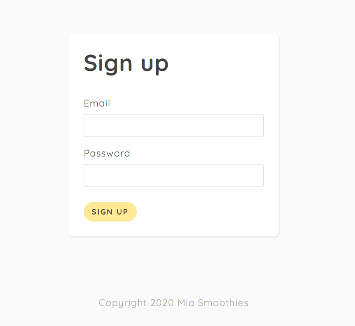
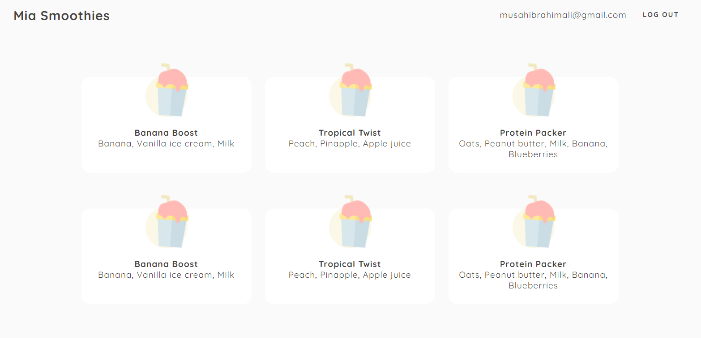

# **preview**

## instructions

- install node js
- clone this repo
- rename `config/keys.example.js` to `config/keys.js` and fill out the details
- create a secret key for the `JWT_SECRET`
- change the `JWT_EXPIRES_IN` value if needed
- run `npm install` or `yarn install`
- run `npm start` or `yarn start` for starting without watching
- run `npm run dev` or `yarn dev` for running the server in watch mode
